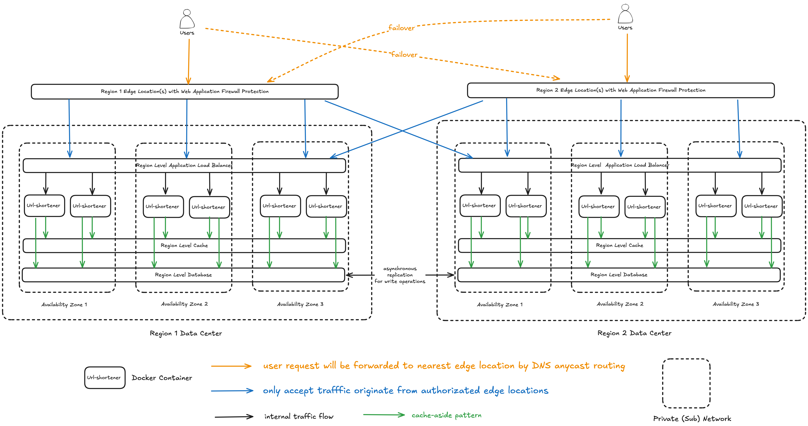
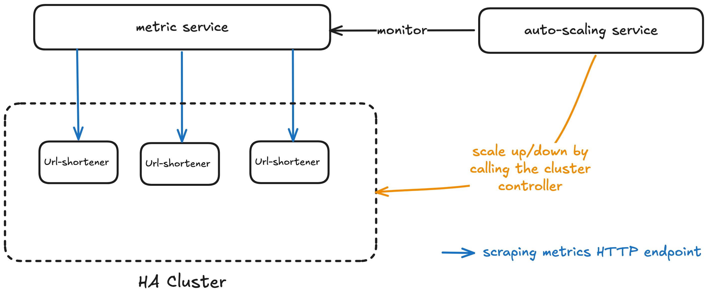

# A URL shortener service


## Table of Contents

- Requirements
- Overall System Architecture Design

---

## Requirements

### Functional Requirements

We need to provide a simple REST API that supports two endpoints:

#### 1. URL submission

Request:

```json
POST /newurl
{
    "domain": "shortenurl.org",
    "url": "https://www.google.com"
}
```

Response Payload:

```json
{
    "url": "https://www.google.com",
    "shortenUrl": "https://shortenurl.org/g20hi3k9Z"
}
```

#### 2. Shorten redirect URL

Request:

```
GET /{shortenUrl}
shortenUrl - regex /[a-zA-Z0-9]{9}/
```

Response:

```
GET /g20hi3k9Z
HTTP 304 to saved link (e.g. https://www.google.com according to the previous example)
```

Assumptions:

- the `shortenUrl` needs to be unique
- anyone can call both two endpoints without authentication and authorization
- the `domain` field of the `POST /newurl` request payload is used to allow user to control the domain name of the shorten url
    - we

### Non-Functional Requirements

- High Availability: highly available and no single point of failure.
- Scalability: 
    - scaling target: 1000+ req/s, after scaling-up/out without major code change.

---

## System Architecture Design

### Deployment Architecture

This architecture is designed with a focus on how the system scale globally for handling high volume of traffic and tolerating zone/region level failures that can be fully implemented with AWS services and defined as code.



- Key Technoliges: 
    - Edge Location for reducing propagation delay
    - Cache for fast read operation
    - Database for durability and propagating writing operation across regions
    - DNS for seperating traffic per region and service discovery
    - Application Load Balancer for load balancing across url-shorten service
    - Web Application Firewall: rate limiting, inspect and filter suspicious HTTP requests
- Key Assumption: the system is read-heavy. The volume of `GET /{shortenUrl}` requests is much larger than the volume of `POST /newurl` requests.
- The term *region level* denotes the service is highly available and can tolerate at least one availability zone failure
- Even though we say the database is *region level*, no data loss with high probability under entire data center failure
- Main Cache Hierarchy: Edge Location -> Region Level Cache
    - Edge location: absorb most of the requests of the popular URLs
    - Region Level Cache: serves uncached or cache-miss requests for all url-shorten service instances
- The internal traffic flow is also controlled for security e.g. the ALB only call the url-shorten service (i.e. ALB can't call the database).
- CI/CD consideration: we choose to use **container** as the portable uint of the url-shorten service because
    - it is lightweight which take up less space and are easier to scale
    - immutability: it packaged all service dependences which enable us to deploy and test it consistently from the test environment to the production environment
    - widely adopted solution with large active community
- The url-shorten service is stateless. We can deploy it in anywhere and at anytime.
- Across the region, we favour availability over consistency when under a network partition.
    - main reason: we want to ensure very high data durability and eventual consistency, yet we don't pay the cost of cross-region round-trip delay
- The other necessary systems such as CI/CD system, intrusion detection/prevention systems, and observability system are omitted as intend
- How to minimise hot spots and increase cache hit rate are also not discussed at this section
- How to support custom multi-domain is not discussed at this section
- Full CQRS pattern(seperate read store and write store) is not applied in this design for simplicity
- The database is a relational database with ACID guarantee that only has one primary replica but write operation can tolerate a zone failure. Here are the reasons:
    - It writes to replicas to a quorum before a write operation is considered successful.
    - The secondary replicas can detect the leader was offline and propose a new leader among the secondary live replicas. 
- Deploying the url-shorten services on the second is optional
- AWS services that we can use: Cloudfront, ALB, Aurora, Route53, ElastiCache, WAF, VPC, EKS
    - we will discussed the details in the following section

### Scaling Mechanism



The mechanism can be realized in many established solutions that can support different scaling strategy without modifying the core logic of url-shorten service source code. Also, it is applicable for other services that require auto-scaling. If we use kubernetes to orchestrate the containers, we can use the [kubernetes horizontal pod autoscaler](https://kubernetes.io/docs/tasks/run-application/horizontal-pod-autoscale/) for implementing this mechanism. 

---

## Database Scheme


```
```

---

## CI/CD Design/Considerations

### CI Pipeline

1. triggerd by pass the code peer review and be able merge the code change into main branch of the git repository
    1. assume we use trank based development git branch strategy
1. code linting
1. static code analysis for identifying vulnerability and unused dependencies
1. run all unit tests
1. run fuzz tests for discovering unknown bugs
1. build container image
1. run integration tests for testing integration with external dependences such as cache and database
1. sign the image to ensure the image is built from trusted source or pipeline
1. push the image to container registry
1. trigger CD pipeline (if the CD pipeline is push-based)

### CD Pipeline per environment and per region

- The CD pipeline is a process of building and testing the deployment artifact for allowing a particular system can be running on a particular environment. For example, if the system running environment is kubernetes worker nodes, the pipeline may need to build a list of kuberentes objects such as Deployment, ConfigMap, Secret, and Namespace.
- We promote the artifact from lower environments such as DEV and STG to production environment.
- In general, the pipelines should be mirrored except the difference related to the environment specific configurations for consistency.
- For each environment, we can use **canary** deployment strategy to deploy the artifact to production environment to reduce the risk of widespread outstage of all users.
- The CD pipeline/system should provide rollback mechanism. For example, if we use ArgoCD and we want to rollback the container image from v1.0.1 to v1.0.0, we just need to simply change the container image version v1.0.0 in the artifact.

---

## Tech Stack

- EKS:
    - can leverage kubernetes features such as auto-scaling and automated rollout and rollback
    - container can be automatically distributed across multiple EC2 nodes
        - avoid a single node network bandwidth become our service botteneck
    - assume we need strong control on the operating system e.g. we need OS security hardening
    - control plane is managed by AWS which can reduce the maintenance overhead
- VPC:
    - necessary for deploying compute or storage resources on AWS
    - isolate our workload to other AWS users
- CloudFront:
    - more than 400 edge locations across over 90 cities and 48 countries
    - can integrate with WAF seamlessly
- Route53:
    - publish our edge location and load balancer domain names
    - manage internal domain names
    - Mult-AZ Resolver Endpoint SLA: 100% refund when the uptime is less than 99.50% 
- Elasticache:
    - 99.99% uptime SLA for its Multi-AZ
    - can achieve over 500 million requests per second per cluster
        - https://aws.amazon.com/blogs/database/achieve-over-500-million-requests-per-second-per-cluster-with-amazon-elasticache-for-redis-7-1/
- Aurora DB:
    - 99.50% uptime SLA for its Multi-AZ
    - testing on standard benchmarks such as SysBench has shown an increase in throughput of up to 5x over stock MySQL and 3x over stock PostgreSQL on similar hardware.
        - https://aws.amazon.com/rds/aurora/features/?nc1=h_ls#topic-0
 
The above numbers can give a strong sense that we can build the highly available URL shorten systen that can meet our scaling target 1000+ req/sec with these cloud services.

---

## Future Works

- cache strategy tunning e.g. *TTL*
- make sure the shortenUrl key generation collision ratio is lower than our expectation
- add health check endpoints for determining the health and the readiness of the instance by external service e.g. kubernetes
- support distributed tracing for observability
- support multiple domain names
- write REST API specification as code for openness and easier to manage API lifecycle

---

## Credits

- Grok AI

