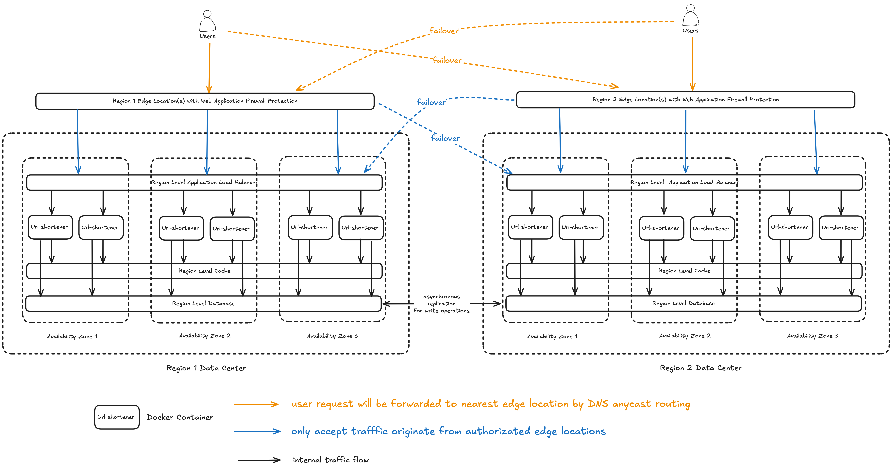

# A URL shortener service


## Table of Contents

- Requirements
- Overall System Architecture Design
- 

---

## Requirements

### Functional Requirements

We need to provide a simple REST API that supports two endpoints:

#### 1. URL submission

Request:

```json
POST /newurl
{
    "domain": "shortenurl.org",
    "url": "https://www.google.com"
}
```

Response Payload:

```json
{
    "url": "https://www.google.com",
    "shortenUrl": "https://shortenurl.org/g20hi3k9Z"
}
```

#### 2. Shorten redirect URL

Request:

```
GET /{shortenUrl}
shortenUrl - regex /[a-zA-Z0-9]{9}/
```

Response:

```
GET /g20hi3k9Z

```

### Non-Functional Requirements

- High Availability: highly available and no single point of failure.
- Scalability: 
    - scaling target: 1000+ req/s, after scaling-up/out without major code change.

---

## Overall System Architecture Design

This architecture is designed with a focus on how the system scale globally for handling high volume of traffic and tolerating zone/region level failures that can be fully implemented with AWS services and defined as code.



- Key Technoliges: 
    - Cache for fast read operation
    - Database for durability and propagating writing operation across regions
    - DNS for seperating traffic per region and service discovery
    - Application Load Balancer for load balancing across url-shorten service
    - Web Application Firewall: rate limiting, inspect and filter suspicious HTTP requests
- Key Assumption: the system is read-heavy. The volume of `GET /{shortenUrl}` requests is much larger than the volume of `POST /newurl` requests.
- The term *region level* denotes the service is highly available and can tolerate at least one availability zone failure
- Even though we say the database is *region level*, no data loss with high probability under entire data center failure
- Cache Hierarchy: Edge Location -> Region Level Cache
    - Edge location: absorb most of the requests of the popular URLs
    - Region Level Cache: serves uncached or cache-miss requests for all url-shorten service instances, ensuring consistency
- The internal traffic flow is also controlled for security e.g. the ALB only call the url-shorten service (i.e. ALB can't call the database).
- CI/CD consideration: we choose to use container as the portable uint of the url-shorten service because
    - it is lightweight which take up less space and are easier to scale
    - it packaged all service dependences which enable us to deploy and test it consistently from the test environment to the production environment
- The url-shorten service is stateless. We can deploy it in anywhere and at anytime.
- Within the region, we favour consistency when under a network partition between the availability zones. Across the region, we favour availability when under a network partition.
    - main reason: we want to ensure high data durability, yet we don't pay the cost of cross-region round-trip delay
- The other necessary systems such as CI/CD system, intrusion detection/prevention systems, and observability system are omitted as intend
- How to minimise hot spots and increase cache hit rate are also not discussed at this section
- AWS services that we can use: Cloudfront, ALB, Aurora, Route53, ElastiCache, WAF

---

## Scaling Mechanism


The mechanism can be realized in many established solutions that can support different scaling strategy without modifying the core logic of url-shorten service source code. Also, it is applicable for other services that require auto-scaling. If we use kubernetes to orchestrate the containers, we can use the [kubernetes horizontal pod autoscaler](https://kubernetes.io/docs/tasks/run-application/horizontal-pod-autoscale/) for implementing this mechanism. 


---

## Database Scheme


```
```

---

## Design Considerations

- No in-memeory cache within the web server for avoiding coordination to invalidate the cache across all instances

---

## Project Structure

---

## Tech Stack


---


---

## Future Works


